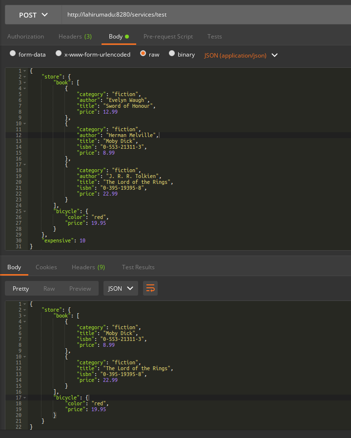

# TruncateJSON
A class mediator to truncate selected part of a JSON payload

# Usage

```xml
<?xml version="1.0" encoding="UTF-8"?>
<proxy xmlns="http://ws.apache.org/ns/synapse" name="test" startOnLoad="true" statistics="disable" trace="disable" transports="http,https">
    <target>
        <inSequence>
            <class name="org.wso2.sample.TruncateJSON">
                <property name="jsonPathString" value="$.store.book[0],$.store.book[*].author,$.expensive"/>
            </class>
            <respond/>
        </inSequence>
    </target>
    <description/>
</proxy>
```
# Invoke



